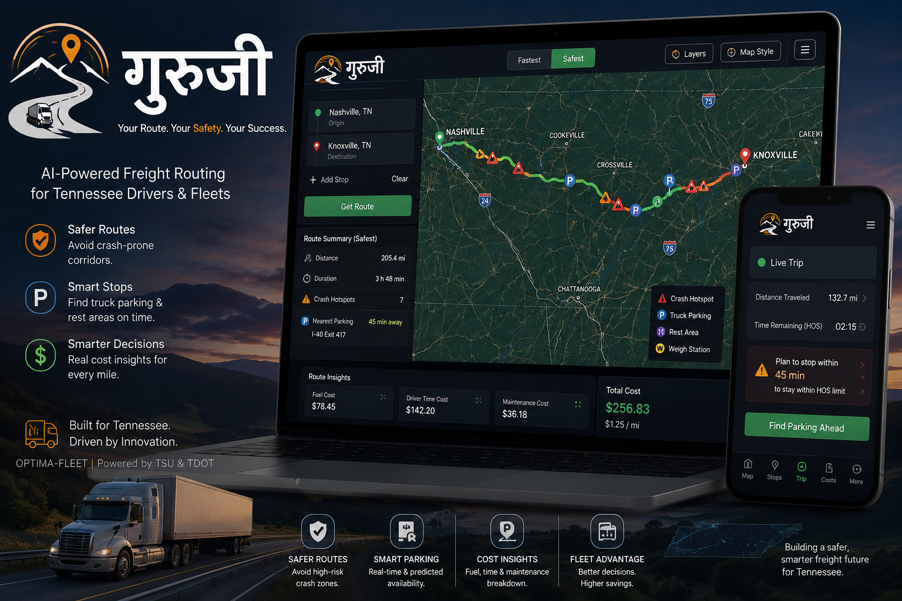

  
  
  # Optima Fleet & Guruji 🚚
  
  **World-Class, AI-Driven Freight Logistics & Fleet Management**

  
  
  
  
  
   

> **Optima Fleet** (code-named *Guruji*) is a high-performance logistics platform designed to revolutionize the way transportation companies manage truck routes, optimize freight economics, and track live fleet data. 

---

## 🎯 The Need for Optima Fleet

In the high-stakes logistics industry, routing a commercial 80,000-pound truck is vastly more complex than routing a passenger car. Fleet owners and dispatchers face significant daily challenges that consumer GPS applications completely fail to address:

- 🚧 **Safety Hazards:** Trucks cannot travel on roads with low bridges, strict weight restrictions, or steep mountain grades without severe safety risks.
- 💵 **Economic Inefficiency:** Every extra mile driven, toll paid, and gallon of fuel burned directly impacts the bottom line. Traditional mapping fails to account for heavy-duty freight economics.
- 🛌 **Hours of Service (HOS) Exhaustion:** Drivers are federally mandated to stop and rest, but finding a commercial rest area with available showers and CAT scales is extremely difficult while en-route.
- 📡 **Lack of Real-Time Intelligence:** Dispatchers need to see the exact location of their fleet against weather radar overlays and interactive geo-fenced warehouse yards.

---

## ✨ Key Features

### 🛣️ Intelligent Routing & Economics Dashboard
Calculates the safest and most economically viable routes. It automatically bypasses hazardous low bridges and weight-restricted zones, while projecting total trip costs (fuel, wages, maintenance) so dispatchers can bid accurately on freight loads.

### ⛈️ Live Environmental Awareness
Equipped with a real-time **NEXRAD weather radar overlay** (color-coded for precipitation intensity), allowing dispatchers to proactively route their drivers around severe storm cells and hazardous driving conditions.

### 🚿 Rest Stop Amenities Tracking
Pulls live data to track truck stops and rest areas along the route. It instantly identifies which facilities offer critical driver amenities such as showers, WiFi, and CAT Scales.

### 🏢 Fleet Mode & Interactive Geo-Fencing
A dedicated **Dispatcher UI** allows fleet managers to monitor all company trucks live on the map. It features interactive geo-fenced zones (such as warehouse yards) to visually manage restricted or alert areas.

### ⚖️ Weigh Stations & Speed Cameras
Visualizes commercial weigh stations, providing their operational status and PrePass bypass probability rates. It also maps known speed traps and red-light cameras with specific speed limit warnings.

### 📊 Fleet Analytics Panel
A robust executive dashboard that visualizes fleet-wide performance. It tracks weekly total miles, average fuel costs, on-time delivery rates, and provides a real-time bar-chart breakdown of driver Hours of Service (HOS) utilization.

---

## 🏗️ Technologies & Architecture

Optima Fleet uses a modern, **100% Serverless Architecture**. All routing, geometric scoring algorithms, OpenStreetMap networking protocols, and math execute blazingly fast entirely within the browser. 

* **Frontend:** React, Vite, Leaflet.js
* **Geospatial Processing:** Turf.js 
* **Data Sources:** OpenStreetMap (OSM) Overpass API, OSRM (Open Source Routing Machine), Iowa Environmental Mesonet (Live Radar)
* **Hosting:** GitHub Pages (Static Delivery)

---

## 🚀 Installation & Local Development

Want to run Optima Fleet on your local machine? It takes less than a minute.

1. **Clone the repository:**
   \`\`\`bash
   git clone https://github.com/shreesomnath/Guruji.git
   cd Guruji/frontend
   \`\`\`

2. **Install dependencies:**
   \`\`\`bash
   npm install
   \`\`\`

3. **Start the local server:**
   \`\`\`bash
   npm run dev
   \`\`\`

4. Open your browser to \`http://localhost:5173\`

---

## 👨‍💻 Developers

Optima Fleet is proudly engineered and developed by:

* **Er. Somnath Luitel** — [Portfolio](https://somnathluitel.com.np/) | [GitHub](https://github.com/shreesomnath)
* **Er. Arbin Amagain** 

   
  <i>Engineered for the future of freight logistics.</i>

